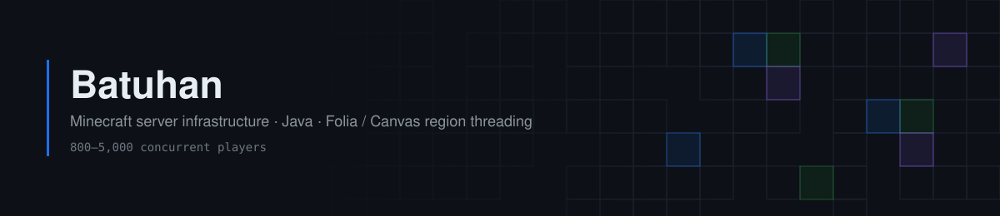

<picture>
  <source media="(prefers-color-scheme: dark)" srcset="assets/banner-dark.svg">
  <source media="(prefers-color-scheme: light)" srcset="assets/banner-light.svg">
  
</picture>

I build and operate the server side of a Minecraft network sized for
800–5,000 concurrent players — Java, region-threaded server software
(Folia / Canvas), and performance profiling.

---

### Infrastructure I operate

|  |  |
|:--|:--|
| **Scale** | 800–5,000 concurrent players |
| **Server software** | Folia / Canvas / Leaf — region threading |

### Engineering work

**Region-threading compatibility.**
On Folia and Canvas, `player.teleport()` throws `UnsupportedOperationException:
Must use teleportAsync while in region threading`. I migrated the network's
plugins onto `teleportAsync()` and region-aware schedulers, and upstreamed the
same fix to zEssentials.

**Packet layer migration.**
Ported an anti-cheat plugin from ProtocolLib to PacketEvents, resolving the GC
pressure and off-thread access problems the port surfaced.

**Allocation and GC tuning.**
Cutting avoidable allocation on hot paths — skipping the regex for messages
without hex colours, paginating log queries, and sending effects as packets
rather than through the potion API.

### Upstream contributions

Merged pull requests:

**[Pumpkin](https://github.com/Pumpkin-MC/Pumpkin)** · Rust
- [#1794](https://github.com/Pumpkin-MC/Pumpkin/pull/1794) — pathfinding optimisation
- [#1912](https://github.com/Pumpkin-MC/Pumpkin/pull/1912) — translation constants in place of string literals

**[zEssentials](https://github.com/Maxlego08/zEssentials)** · Java
- [#212](https://github.com/Maxlego08/zEssentials/pull/212) — command and AFK permission lookup optimisation
- [#230](https://github.com/Maxlego08/zEssentials/pull/230) — 70+ bug fixes, DeathMessage module, 1.21.11 compatibility

**[craft-engine](https://github.com/Xiao-MoMi/craft-engine)**
- [#146](https://github.com/Xiao-MoMi/craft-engine/pull/146) · [#155](https://github.com/Xiao-MoMi/craft-engine/pull/155) · [#222](https://github.com/Xiao-MoMi/craft-engine/pull/222) — localisation

### Tech

Java · Rust · Kotlin · Gradle · Maven · MySQL · Linux

### Contact

iletisim@simple-project.net
