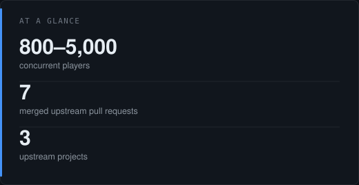
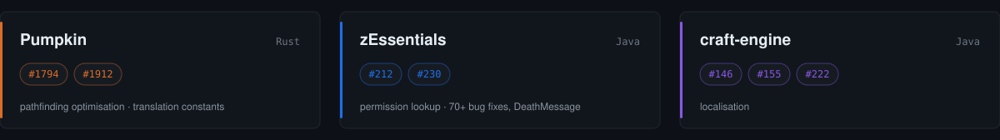

<picture>
  <source media="(prefers-color-scheme: dark)" srcset="assets/banner-dark.svg">
  <source media="(prefers-color-scheme: light)" srcset="assets/banner-light.svg">
  
</picture>

I build and operate the server side of a Minecraft network sized for
800–5,000 concurrent players — Java, region-threaded server software
(Folia / Canvas), and performance profiling.

---

<table>
<tr>
<td width="58%" valign="top">

### Engineering

**Region-threaded server software.**
Folia and Canvas replace the single main thread with per-region scheduling,
which invalidates the assumptions most Bukkit plugins are written against.
I run the network's plugin stack on that model — auditing plugins for
main-thread assumptions, moving teleportation, entity access and scheduled
work onto region-aware APIs, and maintaining patched builds where upstream
has not caught up.

**Cross-server state.**
Player data, punishments and economy stay consistent across the network's
servers — Redis for messaging and shared state, MySQL / MariaDB / PostgreSQL
for durable storage, with the storage layer kept independent of Bukkit so it
can be tested and swapped on its own.

**Protocol layer.**
Packet-level work with PacketEvents: anti-cheat instrumentation, custom entity
and effect handling, and keeping plugins functional across protocol changes
between Minecraft versions.

**Performance.**
Profiling with Spark to locate allocation pressure and lock contention on hot
paths, then removing it. Fixes are upstreamed when they belong in a shared
dependency rather than in the network's own patch set.

</td>
<td width="42%" valign="top">

<picture>
  <source media="(prefers-color-scheme: dark)" srcset="assets/glance-dark.svg">
  <source media="(prefers-color-scheme: light)" srcset="assets/glance-light.svg">
  
</picture>

### Contact

iletisim@simple-project.net

</td>
</tr>
</table>

### Upstream contributions

<picture>
  <source media="(prefers-color-scheme: dark)" srcset="assets/upstream-dark.svg">
  <source media="(prefers-color-scheme: light)" srcset="assets/upstream-light.svg">
  
</picture>

**[Pumpkin](https://github.com/Pumpkin-MC/Pumpkin)** · Rust
- [#1794](https://github.com/Pumpkin-MC/Pumpkin/pull/1794) — pathfinding optimisation
- [#1912](https://github.com/Pumpkin-MC/Pumpkin/pull/1912) — translation constants in place of string literals

**[zEssentials](https://github.com/Maxlego08/zEssentials)** · Java
- [#212](https://github.com/Maxlego08/zEssentials/pull/212) — command and AFK permission lookup optimisation
- [#230](https://github.com/Maxlego08/zEssentials/pull/230) — 70+ bug fixes, DeathMessage module, 1.21.11 compatibility

**[craft-engine](https://github.com/Xiao-MoMi/craft-engine)**
- [#146](https://github.com/Xiao-MoMi/craft-engine/pull/146) · [#155](https://github.com/Xiao-MoMi/craft-engine/pull/155) · [#222](https://github.com/Xiao-MoMi/craft-engine/pull/222) — localisation

### Tech

